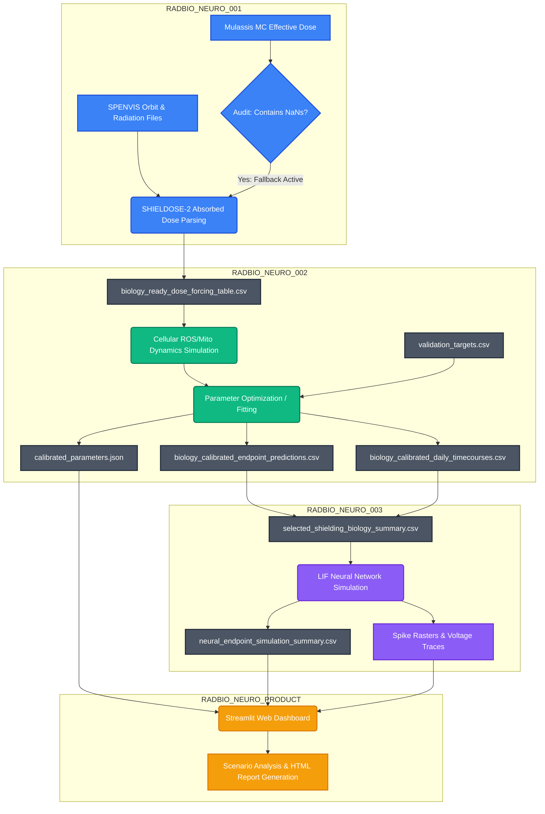
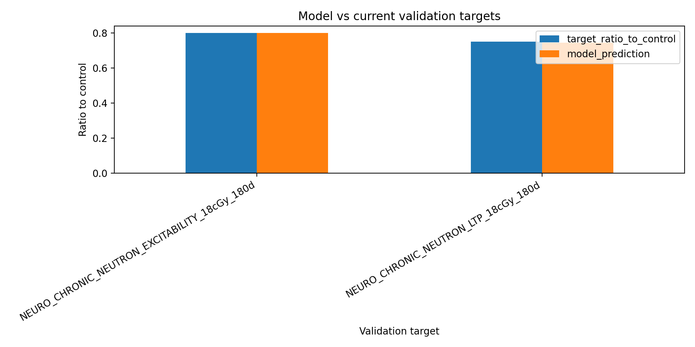
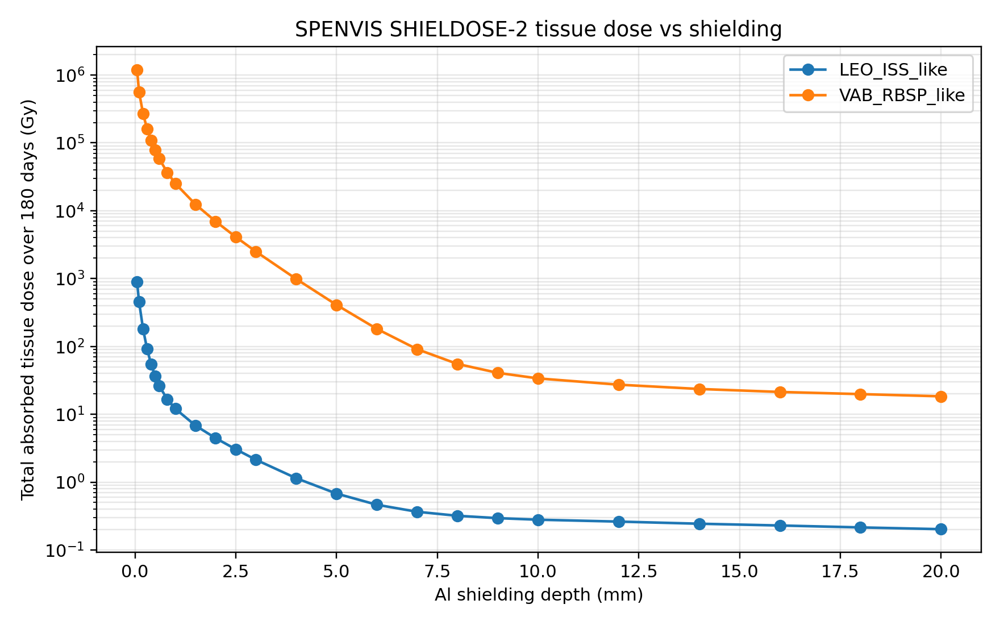
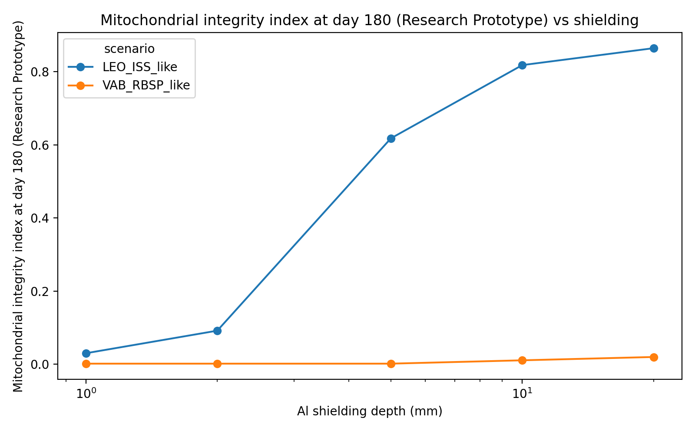
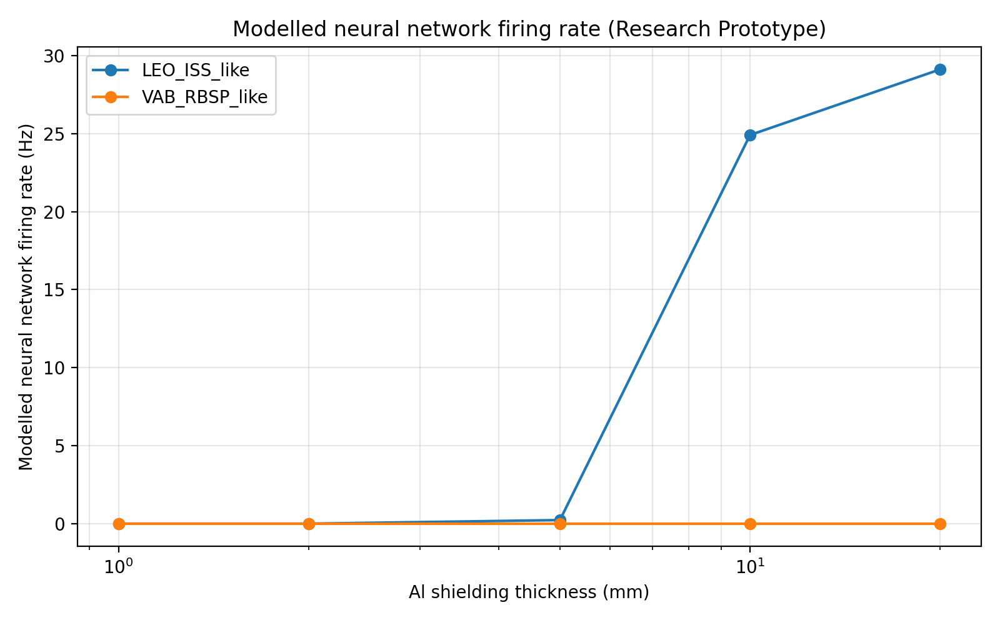
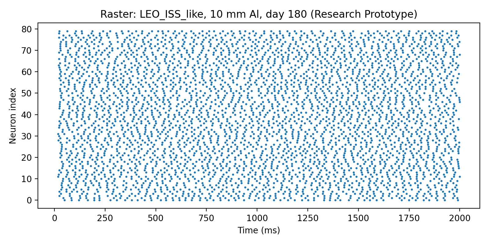
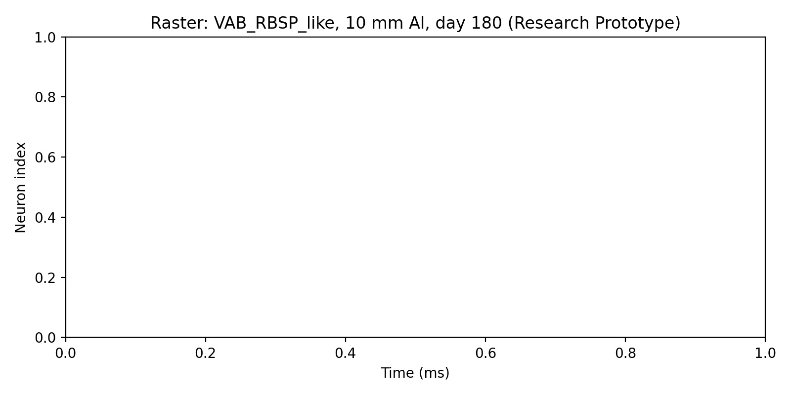

# RADBIO_NEURO: Space Radiation-to-Biology-to-Neural-Risk Pipeline

This repository hosts the **RADBIO_NEURO** modeling pipeline—a clean, reproducible research-product pipeline linking radiation space environments to biological cellular effects and functional neural circuit risk projections.

---

## 📊 System Architecture & Flowchart

Below is the end-to-end data flow and processing architecture of the pipeline.



---

## 🚀 Visualized Results & Key Outputs

Here are key visual outputs automatically generated by the integrated pipeline:

### 1. Biology Model Calibration Fit
The biological parameters are optimized against experimental targets (mouse chronic low-dose endpoints) to align the simulated excitability delta and synaptic degradation with literature anchors:



### 2. Environmental Absorbed Dose vs. Shielding
Absorbed doses over a 180-day mission duration drop logarithmically as equivalent aluminum shielding thickness increases from 1 mm to 20 mm:



### 3. Mitochondrial Integrity Recovery under Shielding
Mitochondrial health index degrades rapidly in thin-shielded scenarios but is preserved behind thicker shielding equivalent:



### 4. Neural Network Firing Suppression
As bioenergetic ATP depletion scales down LIF driving current, network firing rates collapse:



### 5. LEO vs. VAB Neural Population Activity (10 mm Al Shielding)
* **LEO Orbit**: Firing is preserved with stable spike distributions:
  
* **Van Allen Belt (VAB)**: Firing is completely suppressed (blank raster showing zero spike times due to metabolic ATP depletion):
  

---

## 🛠️ Project Execution Order

To run the full end-to-end pipeline and regenerate all outputs:

1. **Verify Python dependencies**:
   ```bash
   pip install -r 03_RADBIO_NEURO_002_BIOLOGY_CALIBRATION/requirements.txt
   pip install -r 04_RADBIO_NEURO_003_NEURAL_LAYER/requirements.txt
   pip install -r 05_PRODUCT_DASHBOARD_API/requirements.txt
   ```
2. **Execute the integrated pipeline**:
   ```bash
   python run_full_pipeline.py
   ```
3. **Regenerate reports & audits**:
   ```bash
   python create_figure_gallery.py
   python create_output_audit.py
   ```
4. **Run Streamlit dashboard**:
   ```bash
   streamlit run 05_PRODUCT_DASHBOARD_API/streamlit_app.py
   ```

---

## ⚠️ Scientific Warnings & Disclaimers

* **Research Prototype**: This codebase is a computational research prototype. All ROS, mitochondrial, and neural outputs are calibrated mathematical scaffolds, not medical, clinical, astronaut-health, or spacecraft operational predictions.
* **SPENVIS Effective-Dose MC NaN Fallback**: SPENVIS effective-dose (Mulassis) outputs contain `NaN` non-numeric entries and are audited but **not** used. The active physics forcing relies on **SHIELDOSE-2 tissue absorbed dose**.
* **Domain Extrapolation**: Biological parameters are fit to chronic low-dose space environments ($0.1$ to $10.0$ mGy/day). Thin-shielded VAB scenarios represent extreme extrapolation stress-tests ($&gt;100$ mGy/day). A blank VAB raster plot indicates simulated metabolic shutdown under extreme stress, not missing data.
